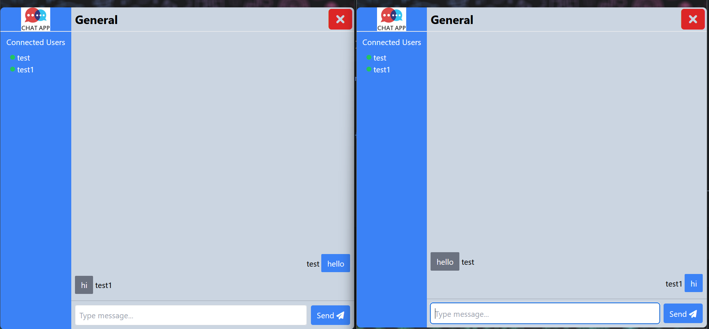

# ChatApp-React

### Welcome to ChatApp-React, a full-stack, real-time chat application built with React on the frontend and Node.js on the backend. This project allows users to join chat rooms, exchange messages, and see which users are online, all in real time.

## Features
* Simple Join: Enter your username and join a chat room with ease. No complicated setup required.
* Real-time Communication: Chat with other users in real-time.
* Multiple Chat Rooms: Join different chat rooms to converse with others on various topics.
* User Presence: See the list of users currently online and in the same chat room.
* Notifications: Receive in-app notifications for new user join.
* Responsive Design: The app is fully responsive, ensuring a seamless experience on any device.

